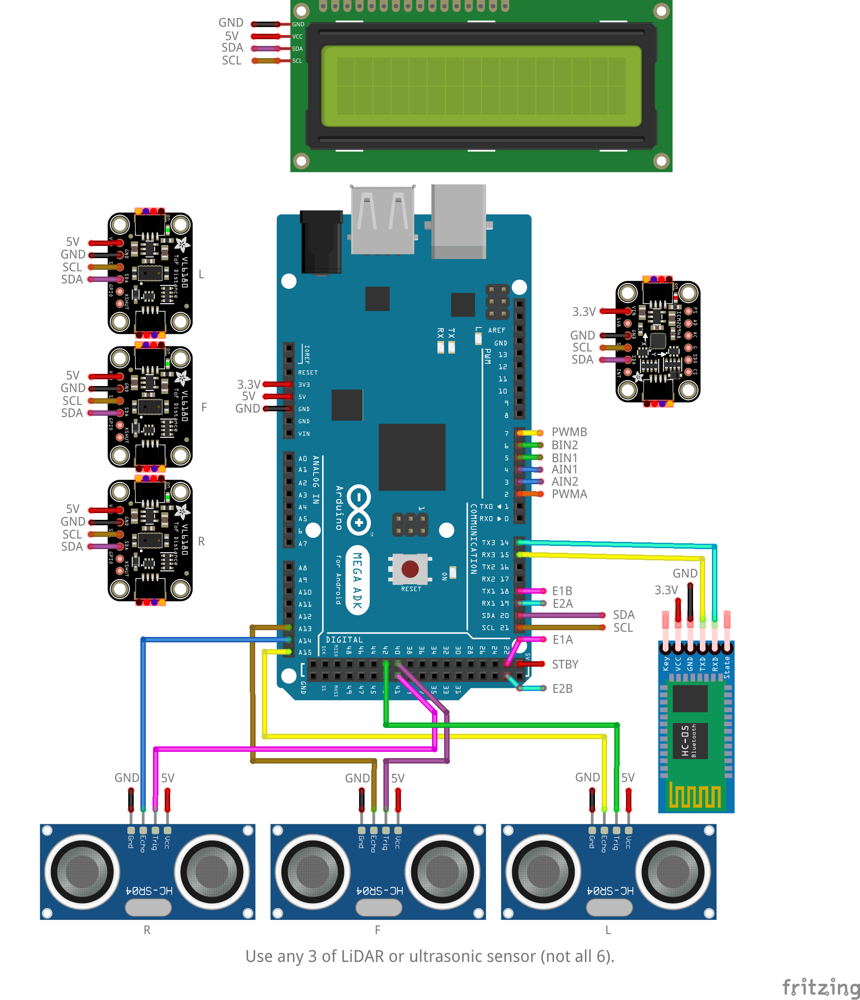
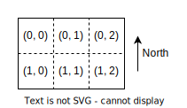
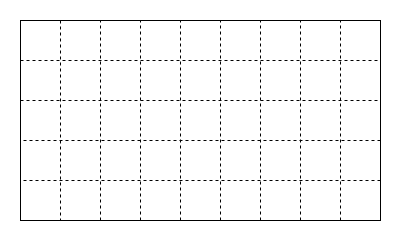
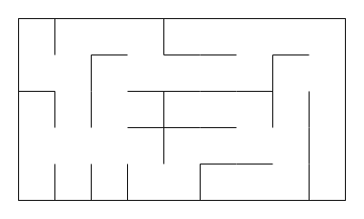

# Project Specification

## Outcome

- Apply relevant theoretical knowledge pertaining to mobile
robots including locomotion, perception and localisation utilising
onboard sensors, navigation and path planning, for complex
problem-solving.
- Apply general computer vision techniques for feature/object
detection and tracking, for complex problem-solving.
- Demonstrate hands-on skills in mechatronics design,
fabrication, and implementation by completing practical activities.
- Collaborate effectively within a team via participation in a
problem-solving competition.

---

## Robot Specification

1. The following electronics are required to be installed onto the robot platform:
    - $1 \times$ of any microcontroller of the following: `Arduino MEGA`.
    - $1 \times$ of any motor driver of the following: `L298N`, `TB6612`.
    - $2 \times$ of any motors (with integrated encoders) of the following: `MG310P20`, `25GA370`.
    - $1 \times$ of any IMU of the following: `ICM-20948`, `CJMCU-20948`.
    - $3 \times$ of any distance sensors of the following: `HC-SR04`, `VL6180X`, `VL53L0X`.
    - $1 \times$ of any bluetooth module of the following: `HC-0X` series.
    - Any battery pack.
    - A fuse rated `1.8 A`.
    - A switch.

---

## Milestone 0: Integration

### Task

1. The robot has integrated the required electronics onto the platform from the [robot specification](#robot-specification).

    A circuit has been provided as an example of how most of the electronics can be connected to the microcontroller. Note that it may not be possible to power all the devices off the microcontroller so a power supply should be used.

    

1. Integrated components are all powered from the on-board battery.
1. Robot abides by the rest of the robot specification requirements.

---

## Milestone 1: Basic Robot Functions 

The purpose of this milestone is to ensure the robot has basic working functionality.

### Environment

- The environment is a grid with the following specification:
	- The grid will contain 9 x 5 cells.
	- The grid will be enclosed i.e. have closed outer walls.
	- Each cell is 250 mm x 250 mm i.e. the distance between centres of neighbouring cells is 250 mm.


### Task

- Robot has simple driving capabilities which is to be demonstrated using teleoperation. The teleoperation is not continuous and drives the robot one step at a time per command:
    - Drive forward 1 cell (250 mm).
    - Turn left 90 degrees on the spot.
    - Turn right 90 degrees on the spot.

- Robot can reliably detect a wall on its left, front, and right side when the robot has been placed at the centre of a cell.
    - Detecte a wall on left side.
    - Detecte a wall on front side.
    - Detecte a wall on right side.

    The detection data can be transmitted via bluetooth and displayed.


- Robot shows correct [maze cell pose](#maze-cell-pose) whilst the robot is moving within a 2 x 3 grid with no walls.
    - Demonstrate correct `(row, col, head)` when robot has moved forward from initial maze cell pose.
    - Demonstrate correct `(row, col, head)` when robot has turned left from initial maze cell pose.
    - Visite all cells in the grid with completely correct sequence of `(row, col, head)`.

    The initial maze cell pose is hardcoded.

    The robot is to be moved using teleoperation.

    The maze cell pose data can be transmitted via bluetooth and printed out.


#### Maze Cell Pose

The maze cell pose is a coordinate system in the form of `(row, col, heading)`. The origin cell `(0, 0)` will always be the top-left of the maze.

The row and column, `(row, col)`, can be deduced from the following grid example:



The possible robot headings are `N`, `E`, `S`, `W`.

---

## Milestone 2: Closed-Loop Driving 

The purpose of this milestone is to ensure the robot has closed-loop driving capabilities. The effectiveness of closed-loop driving will be assessed based on how long the robot can drive whilst minimising accumulation of error.

### Environment

The environment is a grid with the following specification:
- The grid will contain 9 x 5 cells.
- The grid will be enclosed i.e. have closed outer walls.
- Each cell is 250 mm x 250 mm.

The following figure is an example of a valid grid where the dashed lines represent maze cell boundaries and the solid lines represent maze boundaries:



### Task

- Completeness of the robot following a 10-step [motion plan](#motion-plan). 

    The motion plan is hardcoded or sent via bluetooth.
    
    The robot heading will have the direction of a cardinal direction (`N`, `E`, `S`, `W`) within the tolerance of $\pm$ 45 degrees of a cardinal direction.


- Robot displays accurate turning on the spot after 5 consecutive turns.
    - The robot will start facing a cardinal direction.


- Robot displays accurate forward driving after 8 consecutive forward movements.
    - The robot will start at the centre of its starting cell.


#### Motion Plan

A motion plan is a string where:
- The first three characters represents the initial [maze cell pose](#maze-cell-pose) e.g. `(2, 8, N)` becomes `28N`.
- The remaining characters represents the sequence of motions where:
    - `F` instructs the robot to move one cell forward.
    - `L` instructs the robot turn left on the spot.
    - `R` instructs the robot turn right on the spot.

An example motion plan is as follows: `00SFFLR`. The robot is at position `(0, 0)` facing south, and will move forward, forward, turn left, then turn right.

---

## Milestone 3: Maze Mapping & Solving 

This final milestone is the competition which consists of two phases (maze mapping and maze solving) and a quality check.

### Environment

The environment is a maze with the following specification:
- The maze will contain 9 x 5 cells.
- The maze will be enclosed i.e. have closed outer walls.
- Each cell is 250 mm x 250 mm.
- The height of the maze walls is 250 mm.
- The maze will never contain an isolated cell.

The following figure is an example of a valid maze:



### Maze Mapping Phase

The objective of this phase is to use the bird's eye camera above the maze to build a map of the maze.

#### Maze Map

A maze map is ASCII art that may look like the following:
```
 --- --- --- --- --- --- --- --- --- 
|               |                   |
     ---                 ---         
|           |           |   |       |
 ---             --- ---     ---     
|       |   |   |                   |
         ---     --- --- ---         
|   |                   |           |
         ---         ---     ---     
|   |           |           |       |
 --- --- --- --- --- --- --- --- --- 
```

### Maze Solving Phase

The objective of this phase is for the robot to solve the maze for the shortest path between the start and destination cells then drive the robot according to the path plan.

- Purpose:
- Identifying a shortest path from the maze and displaying it at the start of each run on the master device via bluetooth.

    The robot must follow the identified path.

    This information can be displayed in the format of a sequence of maze cell poses, visually with the maze map, or as a motion plan.

    > Shortest path is defined as a path with the least number of cells required to travel from start to destination.
